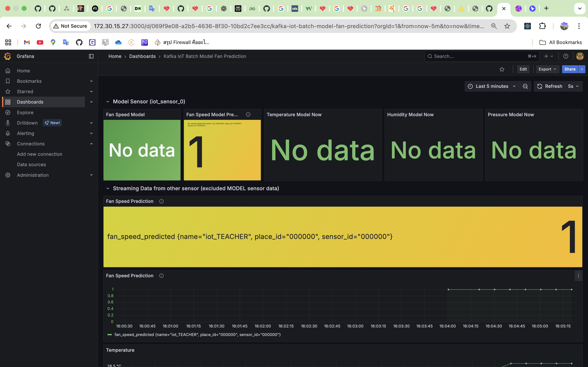
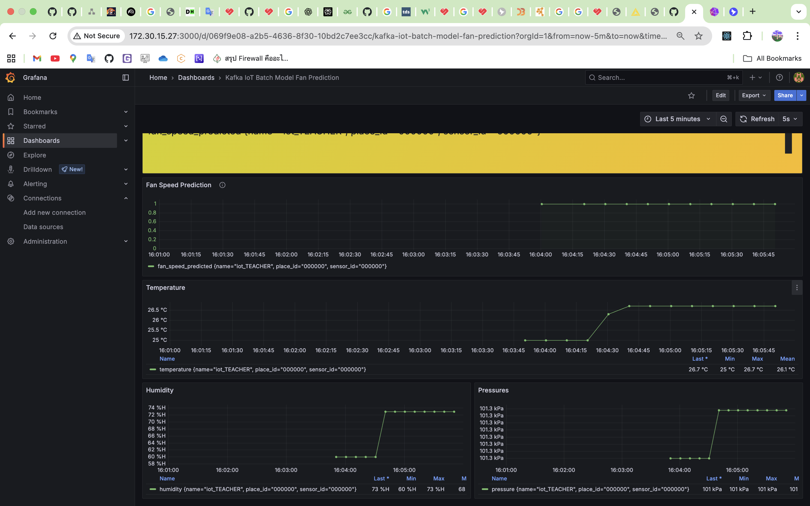

# Online Prediction

<!-- Online Prection ทำงานอย่างไร  -->
รับ data มาและนำ data train model เพื่อให้สามารถทำนาย fan speed ได้อย่างแม่นยำเมื่อมีข้อมูลเข้ามาใหม่จะสามารถทำนาย fan speed ได้

## ปิดการใช้งานของ Batch ML ดังนี้

1. kafka-to-Jsonl
2. Train-from-data
3. Predict-then-Influxdb

## เริ่มใช้งาน Online ML ดังนี้

1. docker compose down batch ml service
2. edit .env file
3. docker compose up online ml service

## ผลที่ได้จากการใช้ ML มีดังนี้

<!-- แนบรูป Grafana  พร้อมอธิบาย -->
เมื่อรัน Online ML และ train เพื่อให้ได้ผลการทำนายที่ > 90% และเมื่อมีการส่งข้อมูลเซนเซอร์ตัวอื่นเข้ามาผลจะเป็นดังภาพ

